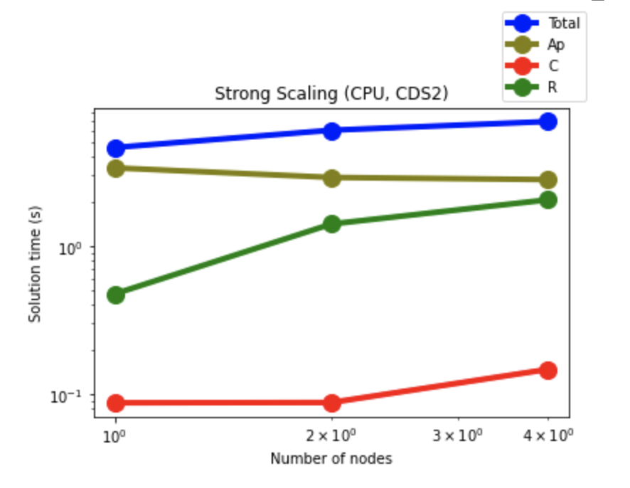

# figures/output

These figures visualize our results in single-node CPU and GPU runs (avGFLOPS
and total memory bandwidth utilization), as well as graphs of the total
reconstruction time and kernel time when performing strong scaling on 1, 2, and
4 nodes on CPUs and GPUs. This also contains the visualizations of the
reconstructed tomograms for CDS1 and CDS2, the outputs of the MemXCT runs.

 

These are the tomographic reconstructions of CDS1 and CDS2 as produced by
MemXCT.

 

These are the performance results for single-CPU runs. The first is the average
reported `avGFLOPS` across 10 single-CPU runs; multiple runs were done since the
variance in CPU performance is relatively high. The second is the average total
memory bandwidth utilization across runs. In terms of reproducing the results
from the original MemXCT paper, these show mixed results. The CPU performance
for large datasets, namely CDS3, is comparable to the performance from the
original paper. However, we were unable to reproduce the CPU performance for
smaller datasets. With a slightly higher clock speed but a smaller vector size
than that of KNL, it would be reasonable to expect a performance of up to 80
GFLOPS on a dataset the size of CDS1, but our runs were severely bottlenecked by
multiple performance concerns.

One of the most unexpected and severe performance differences came from the
CPUs. The HB120rs_v2 SKUs have AMD nodes, which has drastic effects on the
performance of MemXCT. In particular, AMD only supports AVX2 vectorization, as
opposed to Intel's more powerful AVX512 vectorization. GCC is unable to
automatically vectorize many performance-critical loops (especially the two
gather operations), losing much of the performance gains seen in the original
paper on small datasets.

Another concern is memory latency and memory bandwidth. Although the reported
maximum possible memory bandwidth on this SKU is 350 GB/s, we only achieved
utilization of approximately 80 GB/s, with a maximum of 107 GB/s. We observed a
significant drop in CPU utilization on every iteration, likely due to being
bottlenecked by memory accesses.

Despite this performance degradation, by CDS3, we do observe performance
comparable to the performance on large datasets from the original paper. For
larger datasets, optimization bottlenecks are largely overtaken by the high L2
miss rate and limited memory bandwidth. We observe a similar average GFLOPS and
memory bandwidth utilization as that of ADS4 on KNL in the MemXCT paper.

These are the performance results for single-GPU runs. The first is the average
reported `avGFLOPS` across 10 single-GPU runs, and the second is the average
memory bandwidth utilization. This is much closer to the expected performance,
and mirrors the results in the original paper very closely.

These are the results of strong scaling experiments across multiple CPU nodes on
CDS1 and CDS2. These show somewhat unexpected behavior; CPU runs showed
surprisingly fast times on only one node, with slightly degrading performance on
more nodes. The architecture of the HB120rs_v2 greatly affects the strong
scaling studies. Due to the high core count, it's possible that we are observing
a misleading superlinear speedup on smaller datasets, and little performance
gain from adding more nodes, as the entire problem already fits in memory on a
single node. It is possible that this setup caused us to be slowed down by
communication as we add more nodes. Indeed, using more than one MPI rank on even
a single node appears to start to degrade the performance, even with only two
sockets communicating. We hypothesize that these irregularities would disappear
if the scaling experiments were continued to more nodes, or if the scaling
experiments were performed on larger datasets. This is reinforced by the fact
that the performance degradation from 2 to 4 CPU nodes is less severe with CDS2
than with CDS1. In addition, we notice a much faster time for the communication
kernel than expected, as the SKU uses high-speed Infiniband and RDMA.

These are the results of strong scaling experiments across multiple GPU nodes on
CDS1 and CDS2. The GPU scaling proceeds largely as expected, and resemble Figure
11 from the MemXCT paper much more strongly. The speedup on several nodes scales
somewhat slower than expected; this may be because the tested datasets are
relatively small, and the speedup would become more apparent with larger
datasets.

